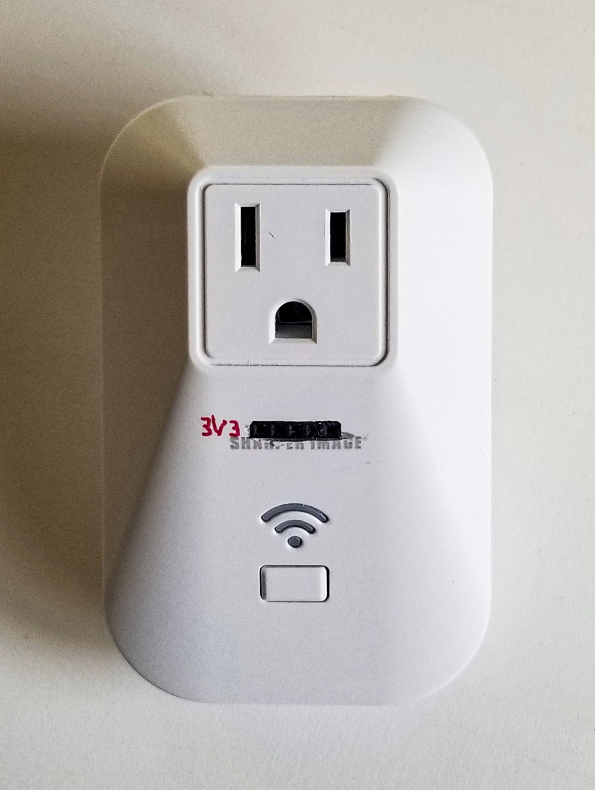

# WiFi Outlet

## Replacement firmware for the 2017 Sharper Image model 70011 WiFi controlled outlet

### About this project

This sketch presents the Sharper Image model 70011 WiFi controlled outlet as a two-page web site 
on the local WiFi network. 

The home page shows two types of schedule for turning the outlet on and off at specified times 
of day. One schedule provides up to three on-off cycles per day. The other has one on-off cycle 
for weekdays and another for weekend days. Using the page you can set the times and which 
schedule to use. The page also lets you turn the outlet on and off manually.

The other page, /commandline.html, shows a "dumb terminal" with the same command line 
interface that's presented over the Serial interface. 



There's a button on the device. Clicking it toggles the outlet on or off.

The implementation uses -- in addition to all the ESP8266 WiFi stuff -- a super simple web 
server I wrote for the purpose. See SimpleWebServer.h for details. It also uses two other 
libraries I wrote for other projects, UserInput, which makes having a command line 
interpreter easy to do, and PushButton, for simple clicky-button support. See them for more 
information.

### Notes on the hardware

* The TYWE3S daughterboard in this device contains an ESP8266 microprocessor, SPI flash and 
  some other stuff I haven't looked at. It exposes some of the ESP8266's pins. Enough to
  let us hack the device. The TYWE3S pin layout is as follows:

```
            <Antenna>
         Gnd         Vcc
      GPIO15         GPIO13
       GPIO2         GPIO12
       GPIO0         GPIO14
       GPIO4         GPIO16
       GPIO5         EN
        RXD0         ADC
        TXD0         RST
```

* GPIO0 is connected to one side of the button on the device. The other side is connected to 
  Gnd. So, "active LOW."

* GPIO13 is connected to one side of the LED. The other side is connected, via a resistor, to 
  Vcc. So, the LED is "active LOW."

* GPIO14 is connected to the gate of transistor Q1, the driver for the relay that turns the 
  outlet on and off. It's "active HIGH." To turn the outlet on, hold GPIO14 HIGH.

* The other GPIOs and ADC aren't hooked to anything, so far as I know.

* To hack the device, you'll need to solder wires to Gnd, Vcc, RXD0, TXD0 and, for convenience, 
  to GPIO0 and RST. Connect all but the last two of these to an FTDI serial-to-USB device via 
  female Dupont connectors (Gnd --> GND, Vcc --> 3V3, RXD0 --> TXD, and TXD0 --> RXD) and a 
  5-pin connector shell. Put a female connector and shell on the GPIO0 wire and a male one on 
  the wire from RST. Find a place on the board connected to Gnd and solder a piece of wire to 
  act as a header pin there. (The pads for the unoccupied R24 and R28 nearest the electrolytic 
  capacitor worked for me.) Hot-glue the wires to the side of the relay for strain relief.

* If you keep the wire lengths for the above to about 10cm you can coil them up inside the 
  device when you reassemble it. (When reassembling, cover up the exposed male connector on the 
  RST wire, or remove it and the GPIO0 wire; you won't need them once the device is put back 
  together.)

* There's even room on the case between the outlet and the button for a rectangular hole to 
  mount and expose the 5-pin Dupont connector. That will let you reprogram the thing with it 
  all put back together.

* To put the ESP8266 into "PGM from UART" mode, making it ready to accept a firmware update, 
  GPIO00 needs to be connected to Gnd when the ESP8266 is reset or powered up. That can be 
  done by attaching the wire from GPIO0 to the new header pin. Leaving GPIO0 floating at 
  power-on or reset results in the ESP8266 entering "Boot from SPI Flash mode." I.e., running 
  normally. 

* When the ESP8266 is "soft reset" in "PGM from UART" mode, which is what happens after 
  Platformio loads new firmware into it, the processor will go into "Boot from SPI Flash" mode, 
  even with GPIO0 attached to Gnd. 

* When the ESP8266 is reset using the ESP.reset() function, it DOES pay attention to GPIO0 and 
  will enter "PGM from UART" mode if GPIO0 is attached to Gnd. 

* To hardware reset the ESP8266, momentarily connect the wire from RST to Gnd or hold down the 
  push-button on the case while you connect to the FTDI device. 

### Copyright and License

Copyright (C) 2023 D.L. Ehnebuske

Permission is hereby granted, free of charge, to any person obtaining a copy
of this software and associated documentation files (the "Software"), to deal
in the Software without restriction, including without limitation the rights
to use, copy, modify, merge, publish, distribute, sublicense, and/or sell
copies of the Software, and to permit persons to whom the Software is
furnished to do so, subject to the following conditions:

The above copyright notice and this permission notice shall be included in all
copies or substantial portions of the Software.

THE SOFTWARE IS PROVIDED "AS IS", WITHOUT WARRANTY OF ANY KIND, EXPRESS OR
IMPLIED, INCLUDING BUT NOT LIMITED TO THE WARRANTIES OF MERCHANTABILITY,
FITNESS FOR A PARTICULAR PURPOSE AND NONINFRINGEMENT. IN NO EVENT SHALL THE
AUTHORS OR COPYRIGHT HOLDERS BE LIABLE FOR ANY CLAIM, DAMAGES OR OTHER
LIABILITY, WHETHER IN AN ACTION OF CONTRACT, TORT OR OTHERWISE, ARISING FROM,
OUT OF OR IN CONNECTION WITH THE SOFTWARE OR THE USE OR OTHER DEALINGS IN THE
SOFTWARE. 
