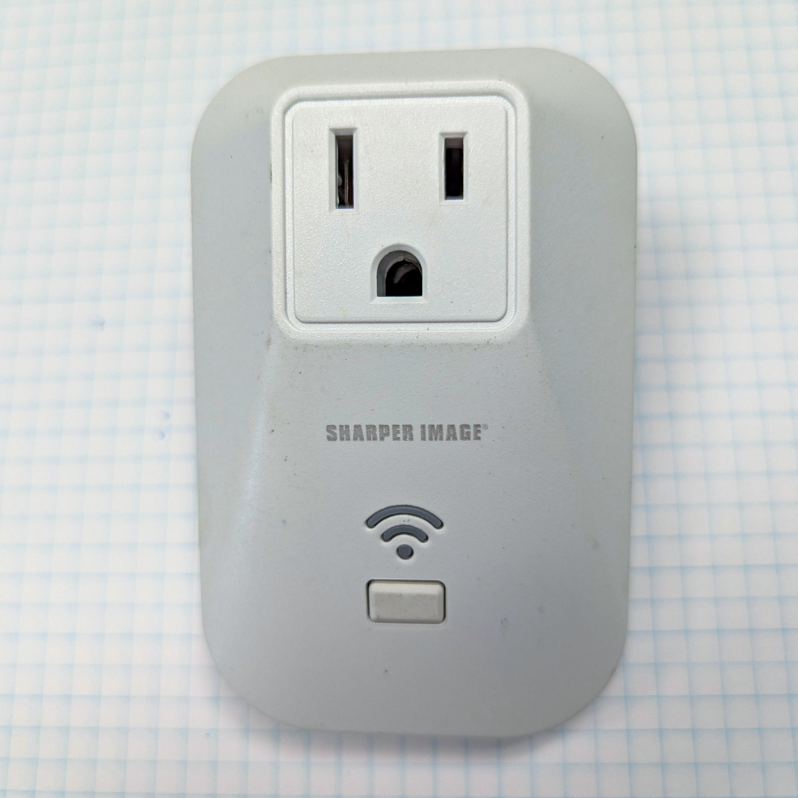
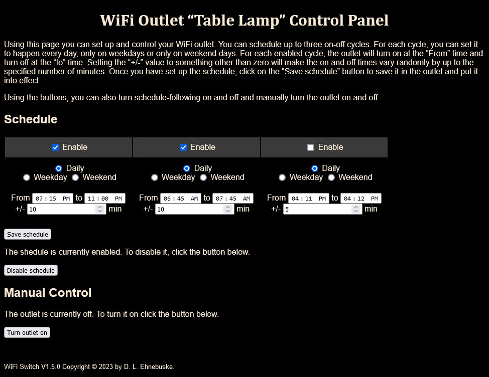
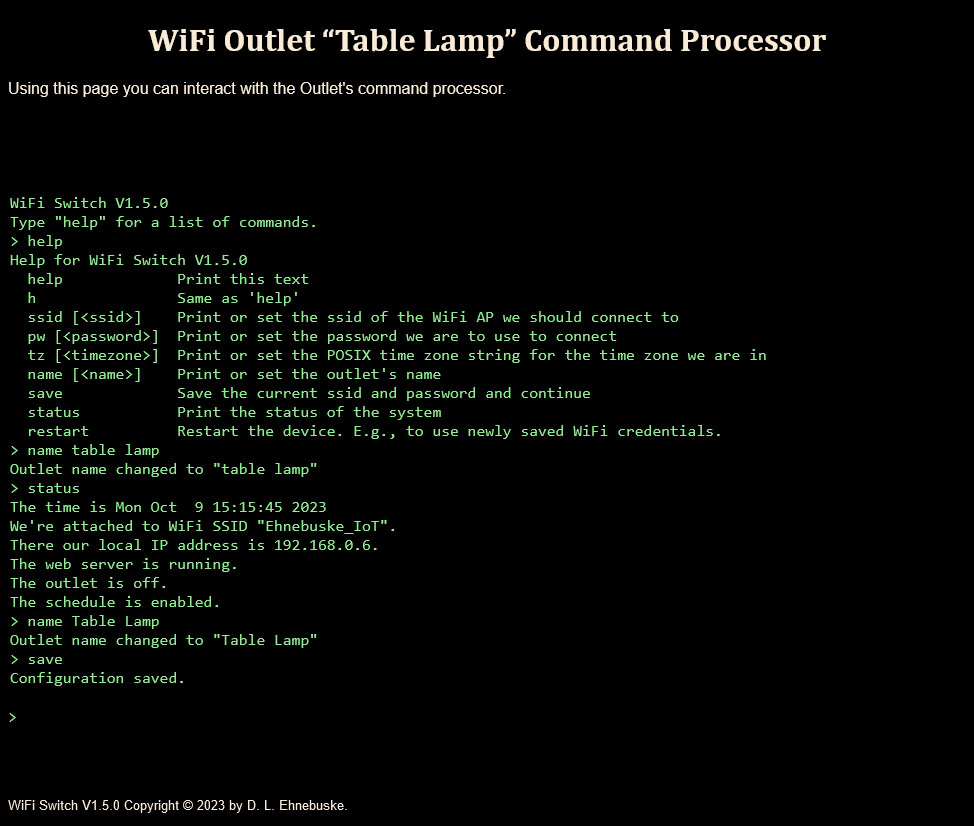
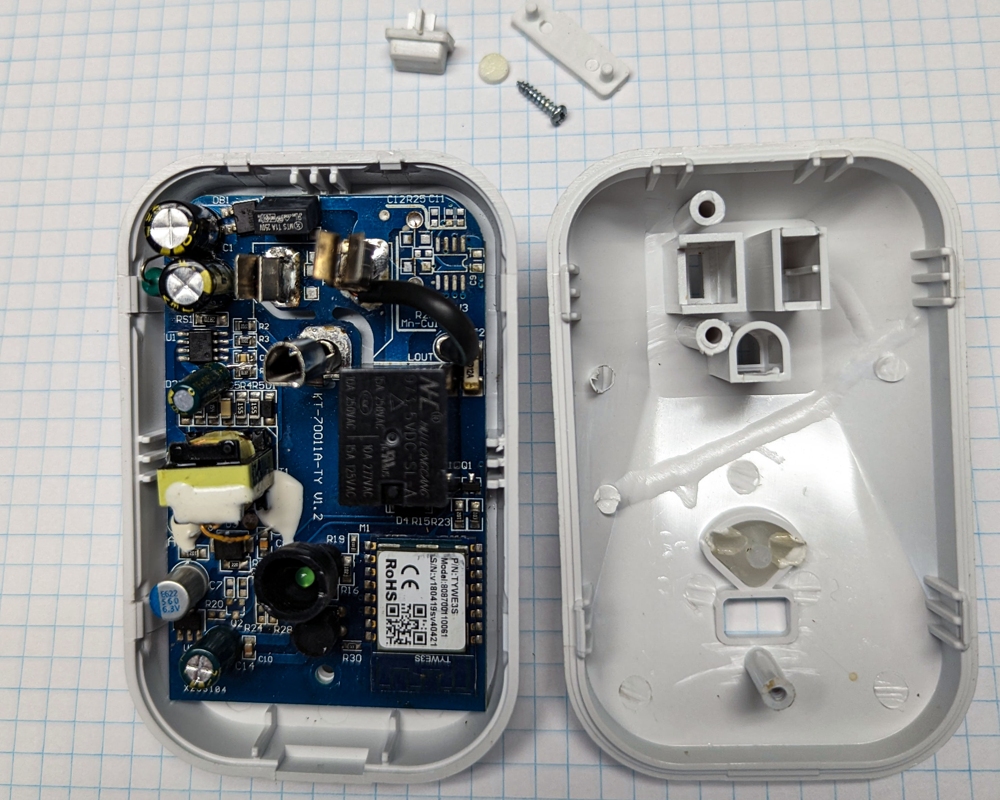
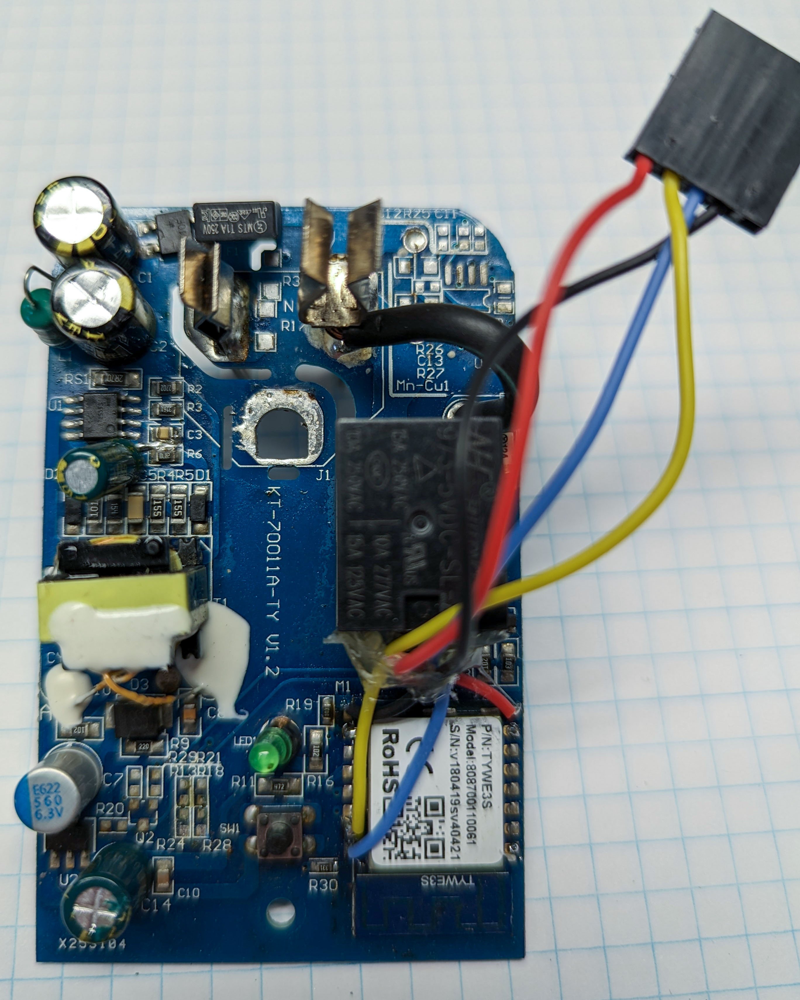

# WiFi Outlet

## Replacement firmware for the 2017 Sharper Image model 70011 WiFi controlled outlet

### About this project

This sketch presents the Sharper Image model 70011 WiFi controlled outlet as a two-page web site 
on the local WiFi network. 



The home page shows the schedule for turning the outlet on and off. 



As you can see, it provides for three on-off cycles, each of which can be enabled or disabled. A 
cycle can be set to apply on a daily basis, only on weekdays or only on weekends. Using the page 
you can set the on and off times for each cycle. You can also specify that each cycle's on and 
off times should be adjusted by a random amount of time to make the schedule be less "mechanical." 

The page also lets you turn the outlet on and off manually and enable or disable the schedule as a 
whole.

Here's the other page, /commandline.html:



It shows a "dumb terminal" with the same command line interface that's presented over the Serial 
interface. 

There's a button on the device. Clicking it toggles the outlet on or off.

The implementation uses -- in addition to all the ESP8266 WiFi stuff -- a super simple web 
server I wrote for the purpose. See SimpleWebServer.h for details. It also uses two other 
libraries I wrote for other projects, UserInput, which makes having a command line 
interpreter easy to do, and PushButton, for simple clicky-button support. See them for more 
information.

### Notes on the hardware

* The TYWE3S daughterboard in this device contains an ESP8266 microprocessor, SPI flash and 
  some other stuff I haven't looked at. It exposes some of the ESP8266's pins. Enough to
  let us hack the device. Looking down on it from above, the TYWE3S pin layout is as follows: 

```
            <Antenna>
         RST         TXD0
         ADC         RXD0
          EN         GPIO5
      GPIO16         GPIO4
      GPIO14         GPIO0
      GPIO12         GPIO2
      GPIO13         GPIO15
         Vcc         Gnd
```


* GPIO0 is connected to one side of the button on the device. The other side is connected to 
  Gnd. So, "active LOW."

* GPIO13 is connected to one side of the LED. The other side is connected, via a resistor, to 
  Vcc. So, the LED is "active LOW."

* GPIO14 is connected to the gate of transistor Q1, the driver for the relay that turns the 
  outlet on and off. It's "active HIGH." To turn the outlet on, hold GPIO14 HIGH.

* The other GPIOs and ADC aren't hooked to anything, so far as I know.

* To hack the device, you'll need to solder wires to Gnd, Vcc, RXD0, TXD0. Connect these to an 
  FTDI serial-to-USB device via female Dupont connectors (Gnd --> GND, Vcc --> 3V3, RXD0 --> TXD, 
  and TXD0 --> RXD) and a 5-pin connector shell. Hot-glue the wires to the side of the relay for 
  strain relief. If you keep the wire lengths for the above to about 10cm you can coil them up 
  inside the device when you reassemble it.



* There's even room on the case between the outlet and the button for a rectangular hole to 
  mount and expose the 5-pin Dupont connector. That will let you reprogram the thing with it 
  all put back together.

* To install new firmware in the ESP8266, disconnect the device from mains power, plug the FTDI 
  dongle into a USB cable, hold down the button on the device and, with the button held down, 
  plug the cable into your computer. This powers the ESP8266 up with GPIO0 grounded, putting it 
  into "PGM from UART" mode. You can then use whatever firmware updating process you usually use 
  for an ESP8266. I use VS Code and Platformio.
  
* When the device's button is up at power-up, GPIO0 is left floating, which results in the ESP8266 
  entering "Boot from SPI Flash mode." I.e., running normally. 

* When the ESP8266 is "soft reset" in "PGM from UART" mode, which is what happens after 
  Platformio loads new firmware into it, the processor will go into "Boot from SPI Flash" mode, 
  even with GPIO0 attached to Gnd. 

* Just for the record, when the ESP8266 is reset using the ESP.reset() function, it is supposed to 
  pay attention to GPIO0 and will (usually) enter "PGM from UART" mode if GPIO0 is attached to 
  Gnd. The firmware executes ESP.reset() when you give it a "reset" command through the 
  commandline interface. 


### Copyright and License

Copyright (C) 2023 D.L. Ehnebuske

Permission is hereby granted, free of charge, to any person obtaining a copy
of this software and associated documentation files (the "Software"), to deal
in the Software without restriction, including without limitation the rights
to use, copy, modify, merge, publish, distribute, sublicense, and/or sell
copies of the Software, and to permit persons to whom the Software is
furnished to do so, subject to the following conditions:

The above copyright notice and this permission notice shall be included in all
copies or substantial portions of the Software.

THE SOFTWARE IS PROVIDED "AS IS", WITHOUT WARRANTY OF ANY KIND, EXPRESS OR
IMPLIED, INCLUDING BUT NOT LIMITED TO THE WARRANTIES OF MERCHANTABILITY,
FITNESS FOR A PARTICULAR PURPOSE AND NONINFRINGEMENT. IN NO EVENT SHALL THE
AUTHORS OR COPYRIGHT HOLDERS BE LIABLE FOR ANY CLAIM, DAMAGES OR OTHER
LIABILITY, WHETHER IN AN ACTION OF CONTRACT, TORT OR OTHERWISE, ARISING FROM,
OUT OF OR IN CONNECTION WITH THE SOFTWARE OR THE USE OR OTHER DEALINGS IN THE
SOFTWARE. 
